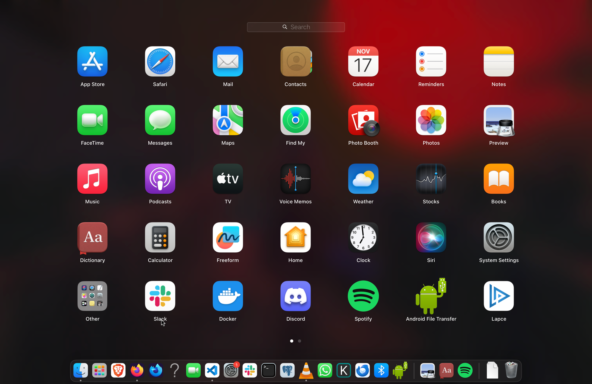

# Meeting the House keeper

On an average computer, there are several software packages, by this, I mean the
likes of **Apple store**, **Safari**, **Slack**, **Spotify**, etc. as seen in the picture below. These packages cannot just work out of the box. Without the operating
system which manages the processes, and other important software like the _boot
loader_[^boot] that helps in starting the computer, they cannot be downloaded or used - the Operating system makes all of this possible. There's a lot more technical detail regarding Operating Systems, feel free to do some reading to suit your interest.

The operating system is the most important software that a computer runs; it manages the computer's hardware, software, memory, and processes. You can't see it like the other software packages that you use, but it operates beneath them all. The operating system belongs to a category of software called **System software**, while the other category includes all forms of software that you interact with daily as a conventional computer user; this category is known as **Application software**.

Other examples of system software are Compilers and Interpreters[^compilers]
which was introduced in module one.

The application software would mean the myriads of tools we use everyday, like
Internet browser, word processors, image viewer.

[^boot]: A small program that acts as an intermediary between the hardware and
the Operating System

[^compilers]: <https://www.quora.com/Why-do-some-people-consider-compiler-to-be-a-system-software>

[^os]: <https://edu.gcfglobal.org/en/computerbasics/understanding-operating-systems/1/>