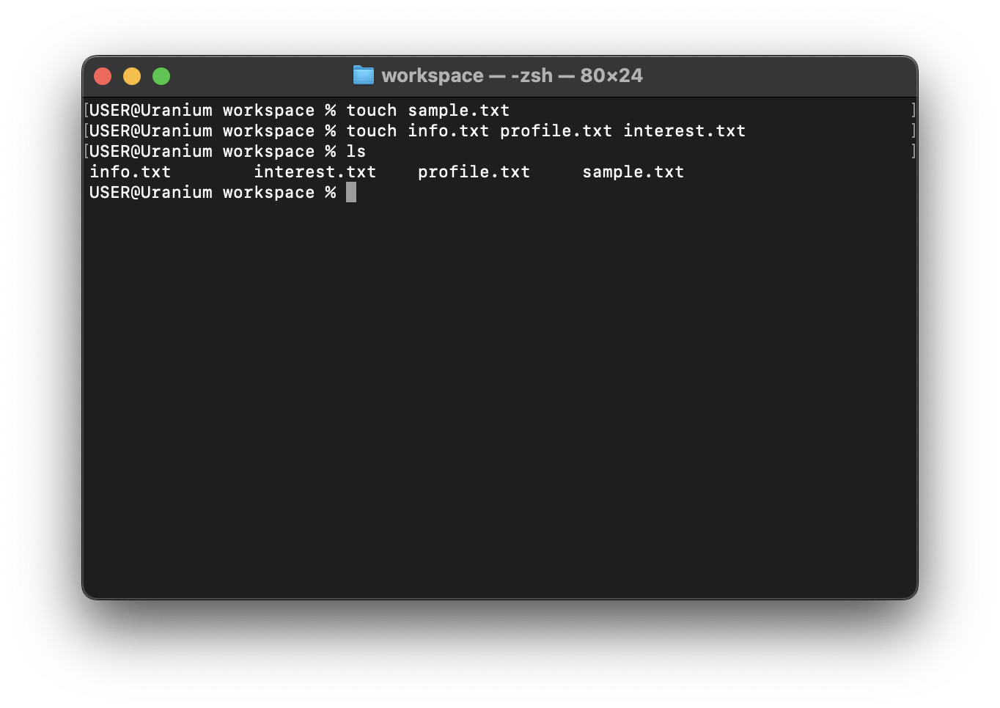

# ls

The ls command stands for list and is used to list the contend of a directory

```sh
ls
```

In the previous module we created four files
`sample.txt, info.txt profile.txt interest.txt` the ls command let's us see
these files


