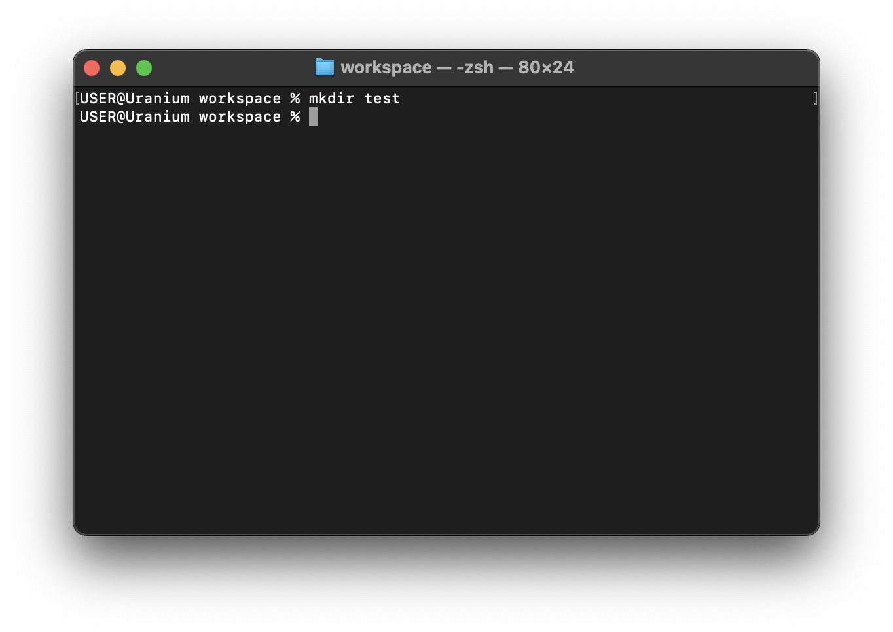

# mkdir

So far we have learnt how to work with files. `mkdir` allow you to create
folder and like [touch command](./touch.md), you can pass one or multiple folder name arguments.

To create a single folder, add a space after `mkdir` then the intended name of the folder.

```sh
mkdir test
```



## Nested folders

This would create a folder in the present directory. If this in not what you
intend, perhaps you want to create folder on a sub subdirectory, consider the
following structure, where the `parent_directory` contains the `root_directory`
which in turn holds the `sub_directory` and the `another_sub_directory`

```
|
--parent_directory
|
----root_directory 
|
--------sub_directory
|
--------another_sub_directory
|
```

To create a directory `nested_dir` from the parent directory inside the
`sub_directory`, do this:

```sh
mkdir ./root_dir/sub_directory/nested_dir
```

## Creating multiple folders

To create multiple folders, specify the folder names separated by spaces.

```sh
mkdir first_folder second_folder third_folder
```

Afterwards, you can use the `ls` command to list the newly created files.
