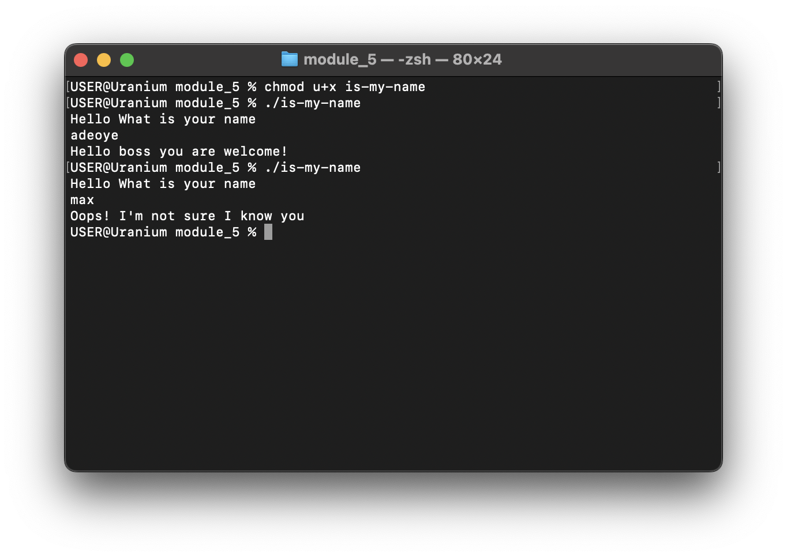

# Conditional evaluation

Like variables, conditional evaluation is on of the key things you'll see in
programming. It's based on a action to execute based on condition.

Bash gives you four keywords `if`, `elif`, `else` and `fi`

1. Conditional evaluation must start with an `if` and end with an `fi`
2. The conditional evaluation can contain zero or more `elif`
3. The base case, or the fallback must be handled by an `else`

Consider this example, we will read the input from the user and check if it a
color of the rainbow

```sh
{{#include ../../code-samples/module_5/is-rainbow-color}}
```


Consider Another example

If my name is "adeoye", print, "Hello boss you are welcome!", if not, print,
"oops! I'm not sure I know you"

```sh
{{#include ../../code-samples/module_5/is-my-name}}
```

