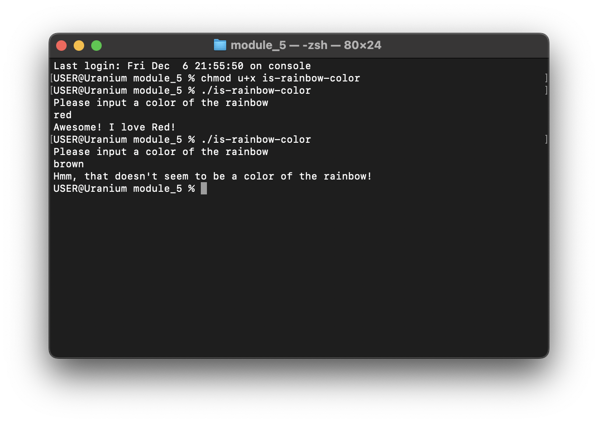

# Conditional evaluation

Like variables, conditional evaluation is one of the key concepts you'll come across in programming. It is used to execute a certain action based on matched conditions.

Bash gives you four conditional keywords `if`, `elif`, `else` and `fi`.

1. Conditional evaluations must start with an `if` and end with an `fi`

2. Conditional evaluations can contain zero or more `elif`

3. The base case or the fallback should be handled by in an `else` statement

Consider the following example, we will read the input from the user and check if it is a rainbow color.

```sh
{{#include ../../code-samples/module_5/is-rainbow-color}}
```



Consider Another example

If my name is "adeoye", print "Hello boss you are welcome!", if not, print "oops! I'm not sure I know you"

```sh
{{#include ../../code-samples/module_5/is-my-name}}
```


